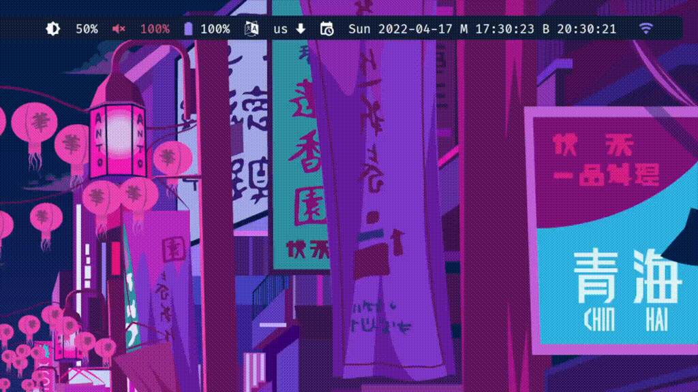

# Polybar Calendar 📅

A **simplified** calendar for polybar or for anyware. Made with python and gtk.

Features:

- Version without event scheduling — makes for a simpler and minimalistic look.
- Uses pywal colors. If the colors are cached. Checkout pywal here: https://github.com/dylanaraps/pywal

## How to use

I use the calendar with polybar. To use it with polybar:

- Checkout the project. For example under: .config/polybar/modules/polybar-calendar-simplified
- Install dependencies: https://pygobject.readthedocs.io/en/latest/devguide/dev_environ.html and https://pygobject.readthedocs.io/en/latest/getting_started.html#
- Change your date module from your polybar config and add : "date = %{A1: .config/polybar/modules/polybar-calendar-simplified/calendar.sh:}%A, %d %B%{A}" to date field. Which will enable click action.
- Be sure you have execute rights on calendar.sh file.
- Depending on your WM you may need to place the window in your compositor settings. I use Bspwm in my bspwmrc file I set the rule like this: 
_bspc rule -a Pycalendar.py state=floating rectangle=400x200+1404+64_

Otherwise you can toggle the calendar by executing calendar.sh.
